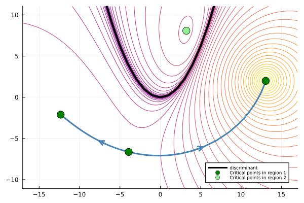
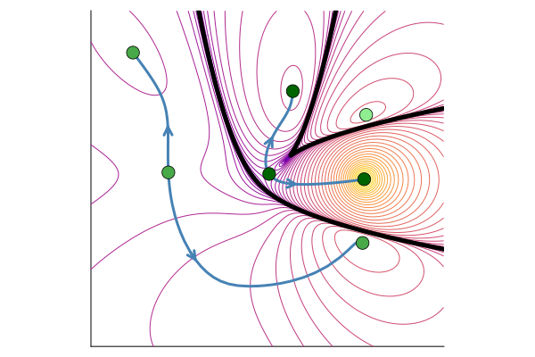

# Computing complements of real hypersurfaces using pseudowitness sets

This repository contains code for the project _Computing complements of real hypersurfaces using pseudowitness sets_ by Paul Breiding, John Cobb, Aviva Englander, Nayda Farnsworth, Jon Hauenstein, Oskar Henriksson, David Johnson, Jordy Lopez Garcia, and Deepak Mundayur.

## Running the code 

Clone the respository (either using Git, or by manually downloading it by clicking the green `Code` button at the top of the GitHub page and selecting `Download ZIP`). Once you have the repository, the easiest way to run the code is to open Julia in the root folder of the repository, activate the environment, and (if this is your first time running the code) instantiate the dependencies:

```julia
using Pkg
Pkg.activate(".")  
Pkg.instantiate()
```

Once the environment is ready, load the functions of the package by including the main source file:

```julia
include("src/functions.jl")
```

## Example

Suppose that we want to study the complement of the discriminant for the quadratic polynomial 
```math
f_{a,b}(x)=x^2+ax+b
``` 
with parameters $a$ and $b$.

We start by setting up the incidence variety $`\{(a,b,x)\in ℂ^3\mid f_{a,b}(x)=f′_{a,b}(x)=0\}`$ of the discriminant, and forming a `ProjectedHypersurface`, which is the central structure of the package.

```julia-repl
julia> @var a b x;
julia> F = System([x^2 + a * x + b, 2x + a], variables = [a, b, x]);
julia> h = ProjectedHypersurface(F, [a, b])
Projected hypersurface of degree 2 in ambient dimension 2
```

We then form a routing function as follows. (If we don't specify the center `c` for the denominator, it is chosen randomly.)

```julia-repl
julia> r = RoutingFunction(h; c=[13, 2])
Routing function for projected hypersurface
===========================================
 Variables: a, b
 Numerator: Projected hypersurface of degree 2 in ambient dimension 2
 Denominator: (1 + (-13 + a)^2 + (-2 + b)^2)^2
```

We find the critical points via the `critical_points` function:

```julia-repl   
julia> routing_points, res, mon_res = critical_points(r);
julia> routing_points
4-element Vector{Vector{Float64}}:
 [13.040296300414134, 1.993819726256856]
 [3.2168112092392143, 8.082538361382136]
 [-3.9180890683992504, -6.635887940807433]
 [-12.339018441254092, -2.1071368134982262]
```

Finally, we connect the critical points that belong to the same component of the complement:

```julia-repl
julia> G, idx, failed_info = partition_of_critical_points(r, routing_points);
```

The first output `G` describes the connected components. We see that the first, third and fourth critical points belong to the same connected component, and that the second one belongs to its own component:

```julia-repl
julia> G
2-element Vector{Any}:
 [1, 3, 4]
 [2]
```

## Illustrations

The following pictures are created via the files `quadratic.jl` and `cubic_two_parameters.jl` in the `examples` directory.

<p align="center"></p>

## Dependencies
The code relies on the following Julia packages:
- `HomotopyContinuation.jl` (for numerical algebraic geometry)
- `DifferentialEquations.jl` (for gradient flow)
- `LightGraphs.jl` (for building the connectivity graph).